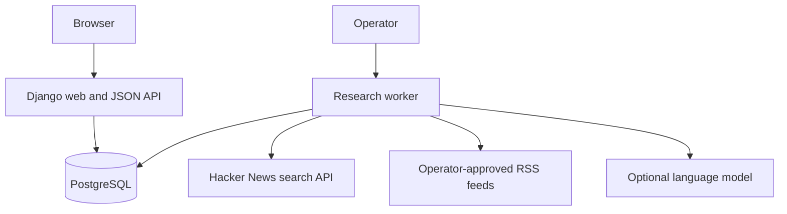

# Conexus — architecture decision, v1

## Product contract

Conexus is a private business-research workspace. It turns monitored signals into source-linked opportunities, explicit challenges, one active commercial experiment, and measured outcomes. It never promises profitability or treats model agreement as evidence. Goals are entered by the operator; unknown targets remain unknown. No private founder history ships in source or sample data.

## System

One Python service codebase, separate web and worker processes. Server-rendered HTML and progressive enhancement avoid an additional SPA deployment, duplicated validation, and browser token storage. Django provides authentication, sessions, CSRF, migrations, escaping, and ORM. PostgreSQL is the production system of record. SQLite is only a convenient local development option. Whitenoise serves versioned static assets; a TLS reverse proxy fronts Gunicorn.

## Boundaries

- `core/models.py`: persisted entities and database invariants.
- `core/services.py`: transactions, ownership, audit, assessment, experiment lifecycle.
- `core/forms.py`: shared validation for HTML and JSON writes.
- `core/views.py`, `core/api.py`: thin authenticated delivery layers.
- `core/research.py`: bounded external retrieval, evidence normalization, optional model review.
- `core/management/commands/worker.py`: durable job claiming, retries, recurring source scheduling.
- `templates/`, `static/`: responsive workspace UI; no third-party browser scripts or trackers.
- `docs/`: schema, endpoints, operations, security, scaling, and remaining release gates.

## Tenancy and authority

Each account owns one workspace in v1; all domain reads and writes are scoped to that workspace. Shared-team invitations and roles are intentionally deferred. UUIDs are identifiers, not authorization. Cross-workspace IDs return 404. Human action is required to start and conclude experiments. No email sending, ad buying, company formation, brokerage, or autonomous financial execution exists. Background research reads public sources only; source text is untrusted data.

## Research loop

1. User creates a source monitor with a query and schedule (minimum one hour).
2. Worker schedules and claims persisted research jobs with a lease.
3. A fixed-host Hacker News adapter or an operator-approved RSS adapter retrieves bounded public data. No generic URL fetcher.
4. Signals are deduplicated within a workspace. Evidence records retain original URL, provenance, retrieval date, and epistemic status.
5. User attaches evidence to an opportunity. A deterministic review surfaces missing buyer access, unsupported claims, counterevidence, unknown economics, and founder constraints.
6. Optional configured AI review creates a labelled draft linked only to supplied evidence IDs. It cannot create factual evidence or approve experiments.
7. Experiment starts atomically, preserving hypothesis, success and stop criteria, deadline, budget, and assessment snapshot. A partial unique constraint allows one active experiment per workspace.
8. Human records outcome, actual spend, customer counts, and revenue. Records describe results without claiming causality from an uncontrolled experiment.

## Scaling strategy

Begin with one web instance, one worker, and managed PostgreSQL. Web processes are stateless except for database sessions. Queries are tenant-indexed and paginated. Network work never runs inside a web request. Jobs use database claims and idempotent writes. PostgreSQL locks coordinate multiple workers and a partial unique index enforces experiment exclusivity across instances.

At measured bottlenecks: use a connection pool, add web replicas, isolate worker pools, adopt a managed queue, move static assets to a CDN, archive bulky source data to object storage, and add read replicas for reporting. Partition high-volume evidence/audit tables only after query measurements justify it. Introduce Redis/distributed edge throttling as traffic requires. Do not introduce microservices, Kubernetes, vector search, or autonomous agent hierarchies merely for imagined scale.

Millions of registered accounts is a planning target, not a tested property. Concurrent users, write rate, source fan-out, retention, and provider quotas determine capacity. Load testing and capacity budgets are required before making throughput claims.

## Release boundary

This is an engineered MVP, not a certification of public-launch readiness. Deployment requires real secrets, TLS, backups with a restore drill, outbound provider approval/configuration, mail-based account recovery or an operator support process, dependency/security review, and load testing. Broad social/news/financial connectors require their own access agreements; only the explicitly implemented adapters are advertised as available.
